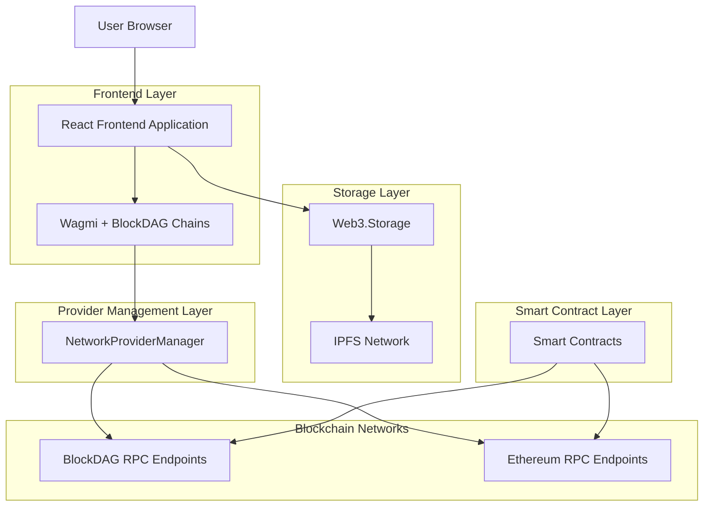
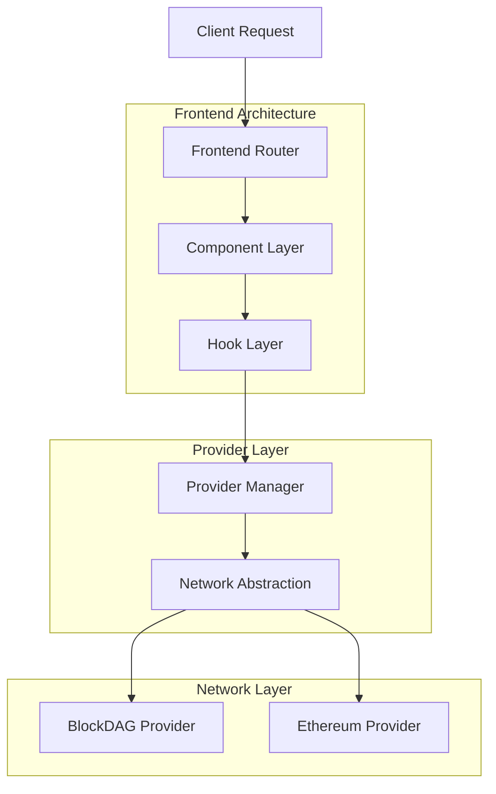
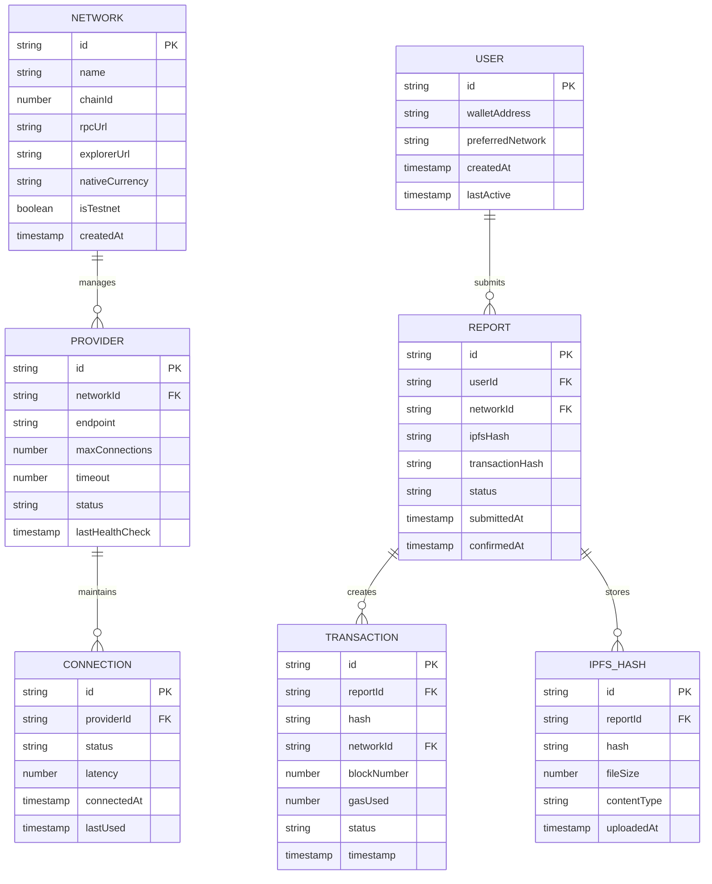

# BlockDAG Integration Technical Architecture

## 1. Architecture Design



## 2. Technology Description

- Frontend: React@18 + TypeScript + Wagmi@2 + Viem + TailwindCSS@3 + Vite
- Blockchain Integration: Ethers.js@6 + BlockDAG SDK
- Storage: Web3.Storage + IPFS
- Development: Hardhat + TypeScript
- Wallet Integration: WalletConnect@2 + MetaMask + Injected Wallets

## 3. Route Definitions

| Route | Purpose |
|-------|----------|
| / | Home page with platform overview and navigation |
| /submit | Report submission form with BlockDAG integration |
| /reports | View submitted reports with multi-chain support |
| /profile | User profile and wallet management |
| /network-status | Real-time network health monitoring |
| /admin | Administrative dashboard for report management |

## 4. API Definitions

### 4.1 BlockDAG Network APIs

**Network Health Check**
```typescript
GET /api/network/health
```

Response:
| Param Name | Param Type | Description |
|------------|------------|-------------|
| networks | NetworkHealth[] | Array of network status objects |
| timestamp | number | Health check timestamp |
| overall_status | string | Overall network health status |

Example Response:
```json
{
  "networks": [
    {
      "name": "BlockDAG Testnet",
      "chainId": 94204209,
      "status": "healthy",
      "latency": 150,
      "blockHeight": 1234567
    }
  ],
  "timestamp": 1703123456789,
  "overall_status": "healthy"
}
```

**Provider Status**
```typescript
GET /api/providers/status
```

Response:
| Param Name | Param Type | Description |
|------------|------------|-------------|
| providers | ProviderStatus[] | Array of provider status objects |
| active_connections | number | Number of active connections |

### 4.2 Report Submission APIs

**Submit Report**
```typescript
POST /api/reports/submit
```

Request:
| Param Name | Param Type | isRequired | Description |
|------------|------------|------------|-------------|
| report_data | ReportData | true | Encrypted report content |
| network | string | true | Target blockchain network |
| ipfs_hash | string | true | IPFS hash of uploaded files |
| signature | string | true | User signature for verification |

Response:
| Param Name | Param Type | Description |
|------------|------------|-------------|
| transaction_hash | string | Blockchain transaction hash |
| report_id | string | Unique report identifier |
| status | string | Submission status |

## 5. Server Architecture Diagram



## 6. Data Model

### 6.1 Data Model Definition



### 6.2 Data Definition Language

**Network Configuration Table**
```sql
-- Network configurations for multi-chain support
CREATE TABLE networks (
    id VARCHAR(50) PRIMARY KEY,
    name VARCHAR(100) NOT NULL,
    chain_id BIGINT UNIQUE NOT NULL,
    rpc_url VARCHAR(255) NOT NULL,
    explorer_url VARCHAR(255),
    native_currency VARCHAR(10) NOT NULL,
    is_testnet BOOLEAN DEFAULT false,
    is_active BOOLEAN DEFAULT true,
    created_at TIMESTAMP WITH TIME ZONE DEFAULT NOW(),
    updated_at TIMESTAMP WITH TIME ZONE DEFAULT NOW()
);

-- Provider management for network connections
CREATE TABLE providers (
    id UUID PRIMARY KEY DEFAULT gen_random_uuid(),
    network_id VARCHAR(50) REFERENCES networks(id),
    endpoint VARCHAR(255) NOT NULL,
    max_connections INTEGER DEFAULT 10,
    timeout_ms INTEGER DEFAULT 30000,
    status VARCHAR(20) DEFAULT 'active',
    last_health_check TIMESTAMP WITH TIME ZONE,
    created_at TIMESTAMP WITH TIME ZONE DEFAULT NOW()
);

-- Connection tracking for provider health
CREATE TABLE connections (
    id UUID PRIMARY KEY DEFAULT gen_random_uuid(),
    provider_id UUID REFERENCES providers(id),
    status VARCHAR(20) NOT NULL,
    latency_ms INTEGER,
    connected_at TIMESTAMP WITH TIME ZONE DEFAULT NOW(),
    last_used TIMESTAMP WITH TIME ZONE DEFAULT NOW()
);

-- User management with wallet integration
CREATE TABLE users (
    id UUID PRIMARY KEY DEFAULT gen_random_uuid(),
    wallet_address VARCHAR(42) UNIQUE NOT NULL,
    preferred_network VARCHAR(50) REFERENCES networks(id),
    created_at TIMESTAMP WITH TIME ZONE DEFAULT NOW(),
    last_active TIMESTAMP WITH TIME ZONE DEFAULT NOW()
);

-- Report submissions with multi-chain support
CREATE TABLE reports (
    id UUID PRIMARY KEY DEFAULT gen_random_uuid(),
    user_id UUID REFERENCES users(id),
    network_id VARCHAR(50) REFERENCES networks(id),
    ipfs_hash VARCHAR(100) NOT NULL,
    transaction_hash VARCHAR(66),
    status VARCHAR(20) DEFAULT 'pending',
    submitted_at TIMESTAMP WITH TIME ZONE DEFAULT NOW(),
    confirmed_at TIMESTAMP WITH TIME ZONE
);

-- Transaction tracking for blockchain interactions
CREATE TABLE transactions (
    id UUID PRIMARY KEY DEFAULT gen_random_uuid(),
    report_id UUID REFERENCES reports(id),
    hash VARCHAR(66) UNIQUE NOT NULL,
    network_id VARCHAR(50) REFERENCES networks(id),
    block_number BIGINT,
    gas_used BIGINT,
    status VARCHAR(20) DEFAULT 'pending',
    timestamp TIMESTAMP WITH TIME ZONE DEFAULT NOW()
);

-- IPFS hash tracking for decentralized storage
CREATE TABLE ipfs_hashes (
    id UUID PRIMARY KEY DEFAULT gen_random_uuid(),
    report_id UUID REFERENCES reports(id),
    hash VARCHAR(100) NOT NULL,
    file_size BIGINT,
    content_type VARCHAR(100),
    uploaded_at TIMESTAMP WITH TIME ZONE DEFAULT NOW()
);

-- Indexes for performance optimization
CREATE INDEX idx_networks_chain_id ON networks(chain_id);
CREATE INDEX idx_providers_network_id ON providers(network_id);
CREATE INDEX idx_connections_provider_id ON connections(provider_id);
CREATE INDEX idx_users_wallet_address ON users(wallet_address);
CREATE INDEX idx_reports_user_id ON reports(user_id);
CREATE INDEX idx_reports_network_id ON reports(network_id);
CREATE INDEX idx_transactions_hash ON transactions(hash);
CREATE INDEX idx_transactions_report_id ON transactions(report_id);
CREATE INDEX idx_ipfs_hashes_report_id ON ipfs_hashes(report_id);

-- Initial data for BlockDAG networks
INSERT INTO networks (id, name, chain_id, rpc_url, explorer_url, native_currency, is_testnet) VALUES
('blockdag-testnet', 'BlockDAG Testnet', 94204209, 'https://rpc.primordial.bdagscan.com', 'https://explorer.primordial.bdagscan.com', 'BDAG', true),
('blockdag-mainnet', 'BlockDAG Mainnet', 1, 'https://rpc.mainnet.blockdag.network', 'https://explorer.blockdag.network', 'BDAG', false),
('ethereum-sepolia', 'Ethereum Sepolia', 11155111, 'https://sepolia.infura.io/v3/', 'https://sepolia.etherscan.io', 'ETH', true),
('ethereum-mainnet', 'Ethereum Mainnet', 1, 'https://mainnet.infura.io/v3/', 'https://etherscan.io', 'ETH', false);

-- Initial provider configurations
INSERT INTO providers (network_id, endpoint, max_connections, timeout_ms) VALUES
('blockdag-testnet', 'https://rpc.primordial.bdagscan.com', 20, 30000),
('blockdag-mainnet', 'https://rpc.mainnet.blockdag.network', 20, 30000),
('ethereum-sepolia', 'https://sepolia.infura.io/v3/', 15, 30000),
('ethereum-mainnet', 'https://mainnet.infura.io/v3/', 15, 30000);
```

This technical architecture provides the foundation for resolving BlockDAG integration issues while maintaining compatibility with existing Ethereum infrastructure and enabling seamless multi-chain functionality for the GBV reporting platform.