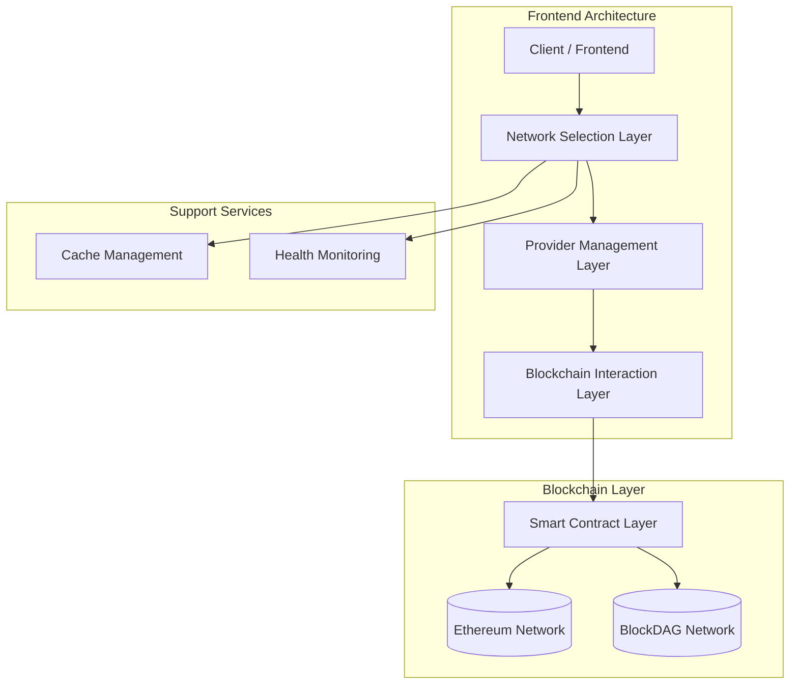
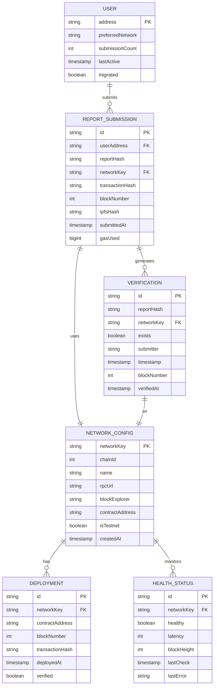
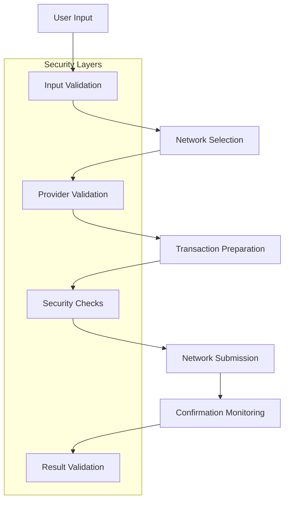

# BlockDAG Technical Architecture Document

## 1. Architecture Design

```mermaid
graph TD
    A[User Browser] --> B[React Frontend Application]
    B --> C[Multi-Network Manager]
    C --> D[Ethereum Provider]
    C --> E[BlockDAG Provider]
    D --> F[Ethereum Mainnet/Sepolia]
    E --> G[BlockDAG Testnet/Mainnet]
    B --> H[IPFS Storage]
    B --> I[Local Storage]
    B --> J[Certificate Generator]

    subgraph "Frontend Layer"
        B
        C
    end

    subgraph "Blockchain Networks"
        F
        G
    end

    subgraph "Storage Layer"
        H
        I
    end

    subgraph "Utility Services"
        J
    end
```



## 2. Technology Description

- **Frontend**: React@18 + TypeScript + TailwindCSS + Vite
- **Blockchain Interaction**: ethers.js@6 + Multi-network support
- **Smart Contracts**: Solidity@0.8.19 + Hardhat development environment
- **Storage**: IPFS (web3.storage) + Browser localStorage
- **Networks**: Ethereum (Mainnet/Sepolia) + BlockDAG (Testnet/Mainnet)
- **Wallet Integration**: MetaMask + WalletConnect support
- **Development Tools**: BlockDAG IDE + Contracts Wizard

## 3. Route Definitions

| Route | Purpose | Network Support |
|-------|---------|----------------|
| / | Home page with platform overview and network status | Multi-network |
| /submit | Report submission form with network selection | Multi-network |
| /verify | Transaction verification and report lookup | Multi-network |
| /certificate | Legal certificate generation from verified reports | Multi-network |
| /network | Network comparison and migration tools | Multi-network |

## 4. API Definitions

### 4.1 Network Configuration API

**Network Information**
```typescript
interface NetworkConfig {
  chainId: number;
  name: string;
  rpcUrl: string;
  blockExplorer: string;
  nativeCurrency: {
    name: string;
    symbol: string;
    decimals: number;
  };
  contractAddress: string;
  faucetUrl?: string;
  isTestnet: boolean;
}
```

**Network Health Check**
```typescript
interface NetworkHealth {
  network: string;
  healthy: boolean;
  latency: number;
  blockHeight: number;
  lastBlockTime: number;
  contractAccessible: boolean;
  lastError?: string;
}
```

### 4.2 Smart Contract Interface

**Report Submission**
```typescript
interface ReportSubmission {
  reportHash: string;
  network: string;
  transactionHash: string;
  blockNumber: number;
  timestamp: number;
  gasUsed: bigint;
  gasCost: string;
}
```

**Report Verification**
```typescript
interface ReportVerification {
  reportHash: string;
  exists: boolean;
  timestamp: number;
  submitter: string;
  network: string;
  blockNumber: number;
  transactionHash: string;
}
```

**Cross-Network Report Status**
```typescript
interface CrossNetworkStatus {
  reportHash: string;
  networks: {
    ethereum?: ReportVerification;
    blockdag?: ReportVerification;
  };
  primaryNetwork: string;
  recommendedNetwork: string;
}
```

### 4.3 Multi-Network Provider Interface

**Provider Manager**
```typescript
class ProviderManager {
  // Get provider for specific network
  getProvider(networkKey: string): ethers.JsonRpcProvider;
  
  // Get contract instance for network
  getContract(networkKey: string, abi: any): ethers.Contract;
  
  // Switch active network
  switchNetwork(networkKey: string): Promise<void>;
  
  // Get network health status
  getNetworkHealth(networkKey: string): Promise<NetworkHealth>;
  
  // Clear provider cache
  clearCache(): void;
}
```

**Wallet Manager**
```typescript
interface WalletState {
  isConnected: boolean;
  account: string | null;
  currentNetwork: string;
  supportedNetworks: string[];
  provider: ethers.BrowserProvider | null;
  signer: ethers.JsonRpcSigner | null;
}

interface WalletActions {
  connectWallet(): Promise<void>;
  disconnectWallet(): void;
  switchNetwork(networkKey: string): Promise<void>;
  addNetwork(config: NetworkConfig): Promise<void>;
}
```

### 4.4 Report Management Interface

**Report Submission Flow**
```typescript
interface SubmissionFlow {
  // Prepare report data
  prepareReport(data: FormData): Promise<{
    encryptedData: string;
    ipfsHash: string;
    reportHash: string;
  }>;
  
  // Submit to blockchain
  submitToBlockchain(reportHash: string, network: string): Promise<{
    transactionHash: string;
    blockNumber: number;
    gasUsed: bigint;
  }>;
  
  // Verify submission
  verifySubmission(transactionHash: string, network: string): Promise<ReportVerification>;
}
```

**Cross-Network Operations**
```typescript
interface CrossNetworkOperations {
  // Verify report across all networks
  verifyAcrossNetworks(reportHash: string): Promise<CrossNetworkStatus>;
  
  // Get optimal network for submission
  getOptimalNetwork(): Promise<string>;
  
  // Migrate user data between networks
  migrateUserData(fromNetwork: string, toNetwork: string): Promise<{
    success: boolean;
    migratedReports: number;
    errors: string[];
  }>;
}
```

## 5. Server Architecture Diagram



## 6. Data Model

### 6.1 Data Model Definition



### 6.2 Data Definition Language

**Network Configuration Storage (localStorage)**
```typescript
// Local storage schema for network configurations
interface StoredNetworkConfig {
  networks: Record<string, NetworkConfig>;
  activeNetwork: string;
  userPreferences: {
    autoSwitchToOptimal: boolean;
    showNetworkComparison: boolean;
    preferredNetworks: string[];
  };
  lastUpdated: string;
}

// Initialize default configuration
const defaultConfig: StoredNetworkConfig = {
  networks: {
    ethereum: {
      chainId: 1,
      name: "Ethereum Mainnet",
      rpcUrl: "https://mainnet.infura.io/v3/PROJECT_ID",
      blockExplorer: "https://etherscan.io",
      nativeCurrency: { name: "Ether", symbol: "ETH", decimals: 18 },
      contractAddress: process.env.NEXT_PUBLIC_ETHEREUM_CONTRACT_ADDRESS || "",
      isTestnet: false
    },
    sepolia: {
      chainId: 11155111,
      name: "Sepolia Testnet",
      rpcUrl: "https://sepolia.infura.io/v3/PROJECT_ID",
      blockExplorer: "https://sepolia.etherscan.io",
      nativeCurrency: { name: "Sepolia Ether", symbol: "ETH", decimals: 18 },
      contractAddress: process.env.NEXT_PUBLIC_SEPOLIA_CONTRACT_ADDRESS || "",
      isTestnet: true
    },
    blockdagTestnet: {
      chainId: 1043,
      name: "BlockDAG Testnet",
      rpcUrl: "https://rpc.primordial.bdagscan.com",
      blockExplorer: "https://primordial.bdagscan.com",
      nativeCurrency: { name: "BlockDAG", symbol: "BDAG", decimals: 18 },
      contractAddress: process.env.NEXT_PUBLIC_BLOCKDAG_CONTRACT_ADDRESS || "",
      faucetUrl: "https://faucet.primordial.bdagscan.com",
      isTestnet: true
    }
  },
  activeNetwork: "ethereum",
  userPreferences: {
    autoSwitchToOptimal: false,
    showNetworkComparison: true,
    preferredNetworks: ["ethereum", "blockdagTestnet"]
  },
  lastUpdated: new Date().toISOString()
};
```

**Smart Contract Deployment Records**
```typescript
// Deployment tracking for multiple networks
interface DeploymentRecord {
  network: string;
  chainId: number;
  contractAddress: string;
  deploymentBlock: number;
  deploymentTx: string;
  timestamp: string;
  verified: boolean;
  abi: any[];
  bytecode: string;
}

// Example deployment records
const deploymentRecords: DeploymentRecord[] = [
  {
    network: "sepolia",
    chainId: 11155111,
    contractAddress: "0x742d35Cc6634C0532925a3b8D4C9db96C4b4d8b",
    deploymentBlock: 4567890,
    deploymentTx: "0xabc123...",
    timestamp: "2024-01-15T10:30:00Z",
    verified: true,
    abi: [], // Contract ABI
    bytecode: "0x608060405234801561001057600080fd5b50..."
  },
  {
    network: "blockdagTestnet",
    chainId: 1043,
    contractAddress: "0x123abc456def789ghi012jkl345mno678pqr",
    deploymentBlock: 123456,
    deploymentTx: "0xdef456...",
    timestamp: "2024-01-15T11:00:00Z",
    verified: true,
    abi: [], // Same contract ABI
    bytecode: "0x608060405234801561001057600080fd5b50..."
  }
];
```

**Performance Metrics Schema**
```typescript
// Performance tracking across networks
interface NetworkMetrics {
  network: string;
  metrics: {
    averageBlockTime: number; // seconds
    averageGasPrice: string; // wei
    averageConfirmationTime: number; // seconds
    successRate: number; // percentage
    uptime: number; // percentage
    lastUpdated: string;
  };
  transactions: {
    total: number;
    successful: number;
    failed: number;
    averageGasUsed: number;
    totalGasCost: string;
  };
}

// Example metrics
const networkMetrics: NetworkMetrics[] = [
  {
    network: "ethereum",
    metrics: {
      averageBlockTime: 12,
      averageGasPrice: "20000000000", // 20 gwei
      averageConfirmationTime: 60,
      successRate: 99.5,
      uptime: 99.9,
      lastUpdated: "2024-01-15T12:00:00Z"
    },
    transactions: {
      total: 150,
      successful: 149,
      failed: 1,
      averageGasUsed: 65000,
      totalGasCost: "1950000000000000" // 0.00195 ETH
    }
  },
  {
    network: "blockdagTestnet",
    metrics: {
      averageBlockTime: 2,
      averageGasPrice: "1000000000", // 1 gwei
      averageConfirmationTime: 10,
      successRate: 99.8,
      uptime: 99.5,
      lastUpdated: "2024-01-15T12:00:00Z"
    },
    transactions: {
      total: 75,
      successful: 75,
      failed: 0,
      averageGasUsed: 65000,
      totalGasCost: "75000000000000" // 0.000075 BDAG
    }
  }
];
```

## 7. Security Architecture

### 7.1 Multi-Network Security Model



### 7.2 Security Implementation

**Network Validation**
```typescript
class NetworkSecurityManager {
  // Validate network integrity
  static async validateNetwork(networkKey: string): Promise<boolean> {
    const config = SUPPORTED_NETWORKS[networkKey];
    if (!config) return false;
    
    try {
      const provider = new ethers.JsonRpcProvider(config.rpcUrl);
      const network = await provider.getNetwork();
      
      // Verify chain ID matches configuration
      if (Number(network.chainId) !== config.chainId) {
        console.error(`Chain ID mismatch for ${networkKey}`);
        return false;
      }
      
      // Check if network is responsive
      const blockNumber = await provider.getBlockNumber();
      if (blockNumber <= 0) return false;
      
      // Verify contract exists if address provided
      if (config.contractAddress) {
        const code = await provider.getCode(config.contractAddress);
        if (code === "0x") {
          console.error(`Contract not found at ${config.contractAddress}`);
          return false;
        }
      }
      
      return true;
    } catch (error) {
      console.error(`Network validation failed for ${networkKey}:`, error);
      return false;
    }
  }
  
  // Validate transaction before submission
  static validateTransaction(tx: any, networkKey: string): boolean {
    const config = SUPPORTED_NETWORKS[networkKey];
    if (!config) return false;
    
    // Basic transaction validation
    if (!tx.to || !tx.data) return false;
    
    // Verify target contract
    if (tx.to.toLowerCase() !== config.contractAddress.toLowerCase()) {
      console.error("Transaction target mismatch");
      return false;
    }
    
    // Gas limit validation
    if (tx.gasLimit && tx.gasLimit > 1000000) {
      console.error("Gas limit too high");
      return false;
    }
    
    // Value validation (should be 0 for our contract calls)
    if (tx.value && tx.value !== "0") {
      console.error("Unexpected transaction value");
      return false;
    }
    
    return true;
  }
  
  // Rate limiting per network
  private static submissionLimits: Map<string, Map<string, number[]>> = new Map();
  
  static checkRateLimit(address: string, networkKey: string, maxPerHour: number = 10): boolean {
    const now = Date.now();
    const hourAgo = now - 3600000;
    
    if (!this.submissionLimits.has(networkKey)) {
      this.submissionLimits.set(networkKey, new Map());
    }
    
    const networkLimits = this.submissionLimits.get(networkKey)!;
    const userTimes = networkLimits.get(address) || [];
    const recentTimes = userTimes.filter(time => time > hourAgo);
    
    if (recentTimes.length >= maxPerHour) {
      return false;
    }
    
    recentTimes.push(now);
    networkLimits.set(address, recentTimes);
    return true;
  }
}
```

## 8. Performance Optimization

### 8.1 Caching Strategy

```typescript
class MultiNetworkCache {
  private cache: Map<string, CacheEntry<any>> = new Map();
  
  // Network-specific caching
  setNetworkData<T>(networkKey: string, key: string, data: T, ttl: number = 300000): void {
    const cacheKey = `${networkKey}:${key}`;
    this.cache.set(cacheKey, {
      data,
      timestamp: Date.now(),
      ttl,
    });
  }
  
  getNetworkData<T>(networkKey: string, key: string): T | null {
    const cacheKey = `${networkKey}:${key}`;
    const entry = this.cache.get(cacheKey);
    
    if (!entry) return null;
    
    if (Date.now() - entry.timestamp > entry.ttl) {
      this.cache.delete(cacheKey);
      return null;
    }
    
    return entry.data;
  }
  
  // Cross-network operations
  getCrossNetworkData(key: string): Record<string, any> {
    const result: Record<string, any> = {};
    
    Object.keys(SUPPORTED_NETWORKS).forEach(networkKey => {
      const data = this.getNetworkData(networkKey, key);
      if (data) {
        result[networkKey] = data;
      }
    });
    
    return result;
  }
  
  // Cache invalidation
  invalidateNetwork(networkKey: string): void {
    const keysToDelete = Array.from(this.cache.keys())
      .filter(key => key.startsWith(`${networkKey}:`));
    
    keysToDelete.forEach(key => this.cache.delete(key));
  }
}
```

### 8.2 Connection Pooling

```typescript
class ConnectionPool {
  private providers: Map<string, ethers.JsonRpcProvider> = new Map();
  private contracts: Map<string, ethers.Contract> = new Map();
  private healthStatus: Map<string, boolean> = new Map();
  
  async getProvider(networkKey: string): Promise<ethers.JsonRpcProvider> {
    if (!this.providers.has(networkKey)) {
      const config = SUPPORTED_NETWORKS[networkKey];
      if (!config) throw new Error(`Unsupported network: ${networkKey}`);
      
      const provider = new ethers.JsonRpcProvider(config.rpcUrl, {
        chainId: config.chainId,
        name: config.name,
      });
      
      // Test connection
      try {
        await provider.getBlockNumber();
        this.providers.set(networkKey, provider);
        this.healthStatus.set(networkKey, true);
      } catch (error) {
        this.healthStatus.set(networkKey, false);
        throw new Error(`Failed to connect to ${networkKey}: ${error}`);
      }
    }
    
    return this.providers.get(networkKey)!;
  }
  
  async getContract(networkKey: string, abi: any): Promise<ethers.Contract> {
    const contractKey = `${networkKey}-contract`;
    
    if (!this.contracts.has(contractKey)) {
      const provider = await this.getProvider(networkKey);
      const config = SUPPORTED_NETWORKS[networkKey];
      
      if (!config.contractAddress) {
        throw new Error(`No contract address for ${networkKey}`);
      }
      
      const contract = new ethers.Contract(
        config.contractAddress,
        abi,
        provider
      );
      
      this.contracts.set(contractKey, contract);
    }
    
    return this.contracts.get(contractKey)!;
  }
  
  // Health monitoring
  async checkHealth(): Promise<Record<string, boolean>> {
    const healthChecks = await Promise.allSettled(
      Object.keys(SUPPORTED_NETWORKS).map(async (networkKey) => {
        try {
          const provider = await this.getProvider(networkKey);
          await provider.getBlockNumber();
          return { networkKey, healthy: true };
        } catch (error) {
          return { networkKey, healthy: false };
        }
      })
    );
    
    const result: Record<string, boolean> = {};
    healthChecks.forEach((check) => {
      if (check.status === 'fulfilled') {
        result[check.value.networkKey] = check.value.healthy;
        this.healthStatus.set(check.value.networkKey, check.value.healthy);
      }
    });
    
    return result;
  }
  
  // Cleanup
  cleanup(): void {
    this.providers.clear();
    this.contracts.clear();
    this.healthStatus.clear();
  }
}
```

This technical architecture document provides the detailed technical specifications needed to implement the BlockDAG integration, complementing the comprehensive implementation guide with specific API definitions, data models, and architectural patterns.