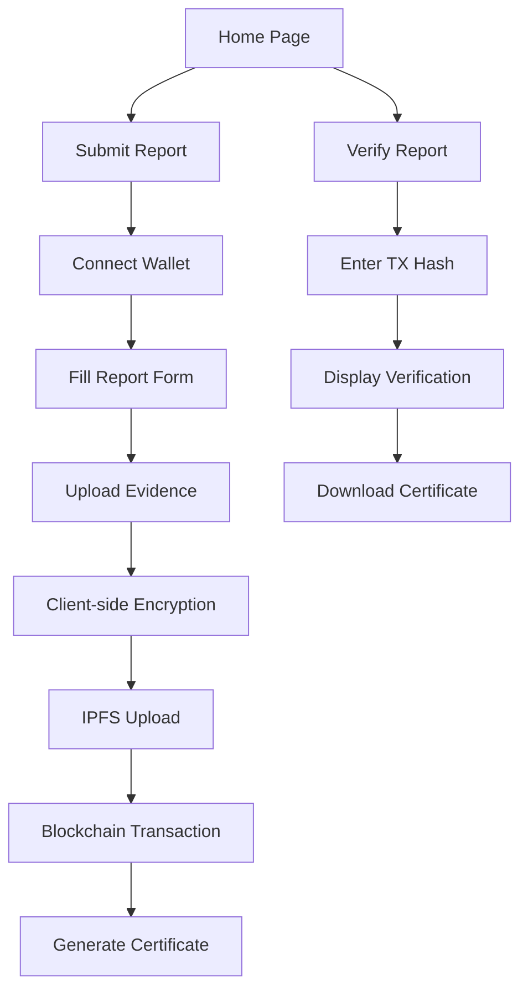

# Decentralized Anonymous Reporting Platform - Product Requirements Document

## 1. Product Overview

A decentralized, secure, and anonymous reporting platform that enables survivors—especially women—to report gender-based violence or human rights violations using blockchain technology. The platform ensures complete anonymity, data integrity, and censorship resistance while providing legally verifiable proof of reports.

The platform addresses the critical need for safe reporting mechanisms where survivors can document violations without fear of retaliation, creating tamper-proof evidence that can be used in legal proceedings. Target users include survivors of gender-based violence, human rights activists, and legal professionals requiring verifiable evidence.

## 2. Core Features

### 2.1 User Roles

| Role | Registration Method | Core Permissions |
|------|---------------------|------------------|
| Anonymous Reporter | MetaMask/WalletConnect connection | Submit reports, upload evidence, generate certificates |
| Verifier | Public access (no registration) | Verify reports using transaction hash, view public proof |

### 2.2 Feature Module

Our decentralized reporting platform consists of the following main pages:
1. **Home page**: platform introduction, safety disclaimer, navigation to submit/verify functions
2. **Submit page**: secure report submission form, file upload interface, encryption status, transaction confirmation
3. **Verify page**: report verification interface using transaction hash, certificate validation, public proof display
4. **Certificate page**: downloadable PDF certificate generation with transaction details and verification links

### 2.3 Page Details

| Page Name | Module Name | Feature description |
|-----------|-------------|---------------------|
| Home page | Hero section | Display platform mission, safety disclaimer, emergency contact information |
| Home page | Navigation | Quick access to submit report and verify report functions |
| Home page | Safety notice | Prominent warning that this is not an emergency service |
| Submit page | Report form | Text input for incident description with character limit and formatting |
| Submit page | File upload | Secure upload for images, audio, video with client-side encryption preview |
| Submit page | Encryption status | Real-time display of encryption progress and IPFS upload status |
| Submit page | Wallet connection | MetaMask/WalletConnect integration for pseudonymous identity |
| Submit page | Transaction confirmation | Blockchain transaction status and hash generation |
| Submit page | Draft management | Save encrypted drafts to localStorage for offline editing |
| Verify page | Hash input | Transaction hash input field with validation |
| Verify page | Verification display | Show report metadata, timestamp, IPFS CIDs without revealing content |
| Verify page | Certificate download | Generate and download verification certificate |
| Certificate page | PDF generation | Create downloadable PDF with transaction hash, report hash, IPFS CIDs, timestamp |
| Certificate page | Verification links | Include PolygonScan links for blockchain verification |

## 3. Core Process

**Anonymous Reporter Flow:**
User accesses platform → reads safety disclaimer → connects wallet → fills report form → uploads evidence files → files encrypted client-side with AES-256 → encrypted files uploaded to IPFS → report hash generated → smart contract interaction to anchor hash on Polygon → transaction confirmed → PDF certificate generated → user downloads certificate with verification details.

**Verifier Flow:**
User accesses verification page → enters transaction hash → system queries blockchain for report metadata → displays timestamp, report hash, IPFS CIDs → generates verification certificate → user can cross-reference with PolygonScan for blockchain proof.

## 4. User Interface Design

### 4.1 Design Style

- **Primary colors**: Deep purple (#6B46C1) for trust and security, soft teal (#14B8A6) for hope
- **Secondary colors**: Warm gray (#6B7280) for text, white (#FFFFFF) for backgrounds
- **Button style**: Rounded corners (8px radius) with subtle shadows, gradient backgrounds for primary actions
- **Font**: Inter font family, 16px base size for accessibility, 14px for secondary text
- **Layout style**: Card-based design with generous white space, mobile-first responsive approach
- **Icons**: Feather icons for consistency, shield and lock icons for security emphasis

### 4.2 Page Design Overview

| Page Name | Module Name | UI Elements |
|-----------|-------------|-------------|
| Home page | Hero section | Large heading with mission statement, gradient background, call-to-action buttons with icons |
| Home page | Safety notice | Prominent warning banner with red accent (#EF4444), emergency contact information |
| Submit page | Report form | Clean textarea with character counter, progress indicators, encryption status badges |
| Submit page | File upload | Drag-and-drop interface with file type icons, upload progress bars, encryption indicators |
| Submit page | Wallet connection | Wallet selection modal, connection status indicator, address display (truncated) |
| Verify page | Hash input | Large input field with validation styling, search button with magnifying glass icon |
| Verify page | Results display | Card layout showing metadata, timestamp formatting, IPFS link buttons |
| Certificate page | PDF preview | Document preview with official styling, download button with PDF icon |

### 4.3 Responsiveness

Mobile-first responsive design optimized for touch interaction. Breakpoints at 640px (mobile), 768px (tablet), and 1024px (desktop). Touch-friendly button sizes (minimum 44px), swipe gestures for navigation, and optimized file upload interface for mobile cameras.

