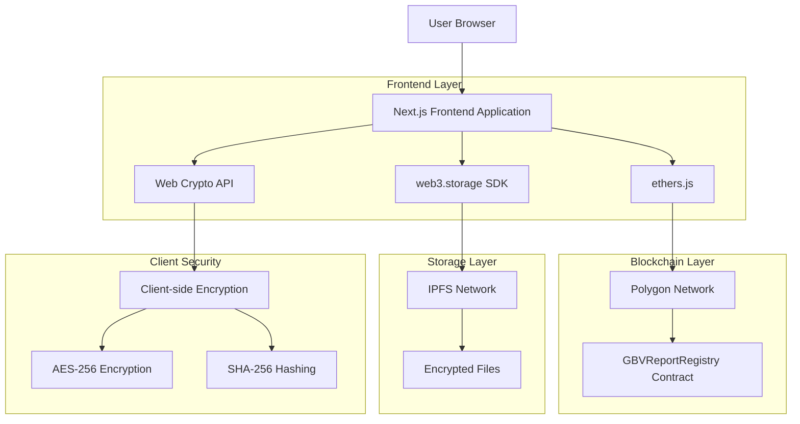
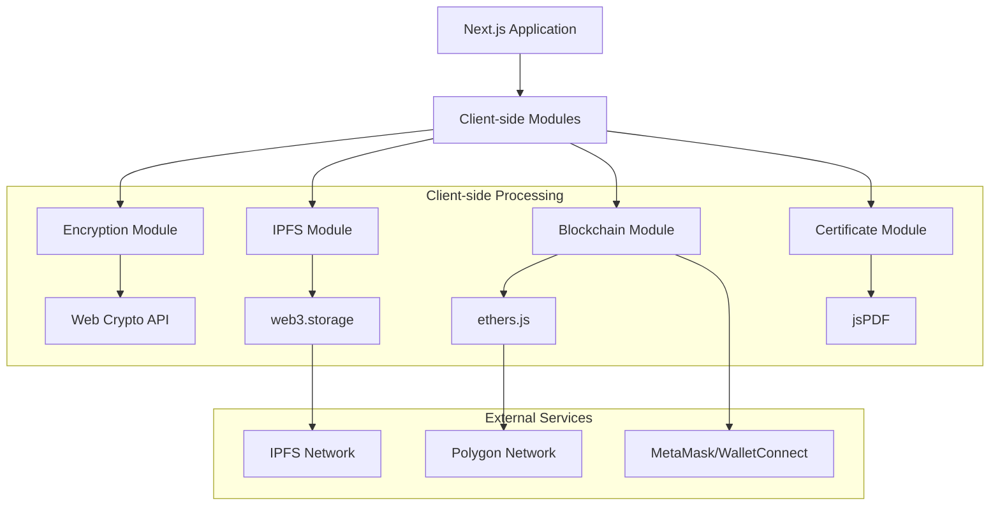
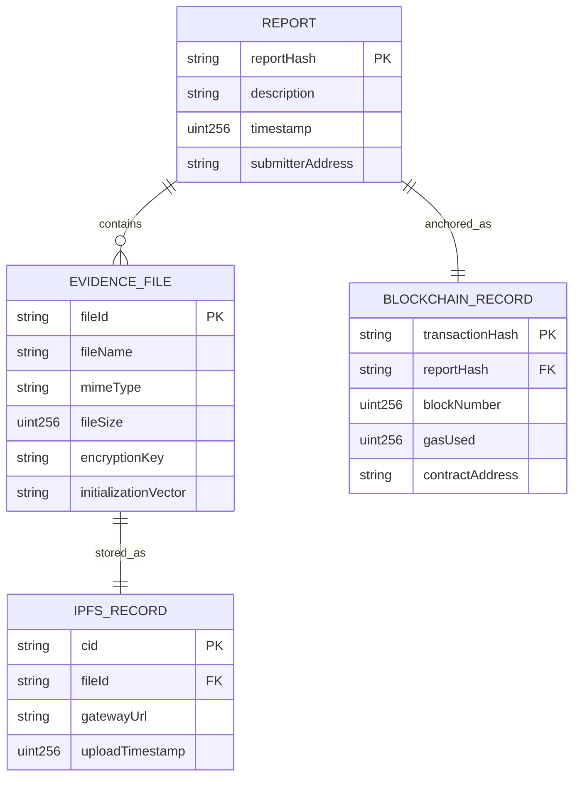

# Decentralized Anonymous Reporting Platform - Technical Architecture Document

## 1. Architecture Design



## 2. Technology Description

* **Frontend**: Next.js\@14 + TypeScript\@5 + Tailwind CSS\@3 + ethers.js\@6

* **Blockchain**: Polygon Network (Mumbai testnet + Mainnet)

* **Storage**: IPFS via web3.storage

* **Encryption**: Web Crypto API (AES-256-GCM)

* **Wallet**: MetaMask + WalletConnect\@2

* **Development**: Hardhat\@2 + Vercel deployment

## 3. Route Definitions

| Route                  | Purpose                                                      |
| ---------------------- | ------------------------------------------------------------ |
| /                      | Home page with platform introduction and safety disclaimer   |
| /submit                | Secure report submission with file upload and encryption     |
| /verify                | Report verification using transaction hash                   |
| /certificate/\[txHash] | Generate and download PDF certificate for specific report    |
| /api/ipfs              | Server-side IPFS upload endpoint (if needed for large files) |

## 4. API Definitions

### 4.1 Core API

**Smart Contract Interaction**

```typescript
// Submit report to blockchain
interface SubmitReportParams {
  reportHash: string;     // SHA-256 hash of encrypted report
  ipfsCIDs: string[];    // Array of IPFS content identifiers
}

// Contract event
interface ReportSubmittedEvent {
  submitter: string;      // Wallet address
  reportHash: string;     // Report hash
  ipfsCIDs: string[];    // IPFS CIDs
  timestamp: number;      // Block timestamp
  transactionHash: string; // Transaction hash
}
```

**IPFS Upload**

```typescript
interface IPFSUploadResponse {
  cid: string;           // Content identifier
  url: string;           // IPFS gateway URL
  size: number;          // File size in bytes
}

interface EncryptedFile {
  encryptedData: ArrayBuffer;  // AES-256 encrypted content
  iv: Uint8Array;             // Initialization vector
  fileName: string;           // Original filename (encrypted)
  mimeType: string;           // File MIME type
}
```

**Certificate Generation**

```typescript
interface CertificateData {
  transactionHash: string;
  reportHash: string;
  ipfsCIDs: string[];
  timestamp: number;
  blockNumber: number;
  polygonScanUrl: string;
}
```

## 5. Server Architecture Diagram



## 6. Data Model

### 6.1 Data Model Definition



### 6.2 Smart Contract Definition

**GBVReportRegistry.sol**

```solidity
// SPDX-License-Identifier: MIT
pragma solidity ^0.8.19;

contract GBVReportRegistry {
    struct Report {
        bytes32 reportHash;
        string[] ipfsCIDs;
        uint256 timestamp;
        address submitter;
    }
    
    mapping(bytes32 => Report) public reports;
    mapping(address => bytes32[]) public userReports;
    
    event ReportSubmitted(
        address indexed submitter,
        bytes32 indexed reportHash,
        string[] ipfsCIDs,
        uint256 timestamp
    );
    
    function submitReport(
        bytes32 _reportHash,
        string[] memory _ipfsCIDs
    ) external {
        require(_reportHash != bytes32(0), "Invalid report hash");
        require(_ipfsCIDs.length > 0, "No IPFS CIDs provided");
        require(reports[_reportHash].timestamp == 0, "Report already exists");
        
        reports[_reportHash] = Report({
            reportHash: _reportHash,
            ipfsCIDs: _ipfsCIDs,
            timestamp: block.timestamp,
            submitter: msg.sender
        });
        
        userReports[msg.sender].push(_reportHash);
        
        emit ReportSubmitted(msg.sender, _reportHash, _ipfsCIDs, block.timestamp);
    }
    
    function getReport(bytes32 _reportHash) external view returns (
        bytes32 reportHash,
        string[] memory ipfsCIDs,
        uint256 timestamp,
        address submitter
    ) {
        Report memory report = reports[_reportHash];
        require(report.timestamp != 0, "Report not found");
        
        return (
            report.reportHash,
            report.ipfsCIDs,
            report.timestamp,
            report.submitter
        );
    }
    
    function getUserReports(address _user) external view returns (bytes32[] memory) {
        return userReports[_user];
    }
}
```

**Deployment Configuration**

```typescript
// hardhat.config.ts
interface NetworkConfig {
  polygonMumbai: {
    url: string;
    accounts: string[];
    chainId: 80001;
    gasPrice: 20000000000;
  };
  polygon: {
    url: string;
    accounts: string[];
    chainId: 137;
    gasPrice: 30000000000;
  };
}

// Contract addresses
interface ContractAddresses {
  mumbai: "0x...";  // Testnet deployment
  polygon: "0x..."; // Mainnet deployment
}
```

**Local Storage Schema**

```typescript
// Encrypted draft storage
interface DraftReport {
  id: string;
  encryptedContent: string;
  timestamp: number;
  fileHashes: string[];
}

// Encryption keys (optional Shamir's Secret Sharing)
interface KeyShare {
  shareId: number;
  encryptedShare: string;
  threshold: number;
  totalShares: number;
}
```

